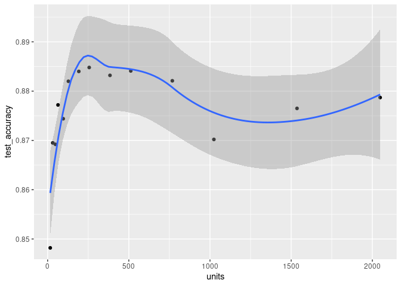

R interface to Guild AI
================

<!-- README.md is generated from README.Rmd. Please edit that file -->

# guildai

<!-- badges: start -->

<div>

[](https://github.com/t-kalinowski/guildai-r/actions/workflows/R-CMD-check.yaml)

R-CMD-check

</div>

<!-- badges: end -->
<!-- a nice screenshot image here-->

*guildai* provides a suite of tools for tracking, visualizing, and
managing training runs and experiments. The {guildai} R package is a
successor to the {tfruns} package.

- Track the hyperparameters, metrics, output, and source code of every
  training run.

- Compare hyperparmaeters and metrics across runs to find the best
  performing model.

- Automatically generate reports to visualize individual training runs
  or comparisons between runs.

- No changes to source code required.

## Installation

The R package provides an interface to [Guild AI
Core](https://guild.ai/). The R package will automatically download and
install Guild AI Core on first use, or you can call `install_guild()`
directly to customize the installation. You can install the **guildai**
package as follows:

``` r
# install.packages("guildai")
remotes::install_github("t-kalinowski/guildai-r")
guildai::install_guild()
```

Guild AI can be used with any machine learning framework, or even no
framework at all. For this introductory example, we’ll start with a
Keras model applied to the fashion mnist dataset.

If you’ve not used Keras from R before and you want to follow along on
your machine, you can install it like this:

``` r
install.packages("keras")
keras::install_keras()
```

## Hello World

### Launch a run

To start, we’ll use an example training script. Here is what it looks
like:

``` r
library(keras)

# Prepare data ----

fashion_mnist <- dataset_fashion_mnist()

c(train_images, train_labels) %<-% fashion_mnist$train
c(test_images, test_labels) %<-% fashion_mnist$test

train_images <- train_images / 255
test_images <- test_images / 255

# Define model ----

units <- 64

model <- keras_model_sequential(input_shape = c(28, 28)) %>%
  layer_flatten() %>%
  layer_dense(units = units, activation = 'relu') %>%
  layer_dense(units = 10, activation = 'softmax')


learning_rate <- 0.001

model %>% compile(
  optimizer = optimizer_adam(learning_rate),
  loss = 'sparse_categorical_crossentropy',
  metrics = c('accuracy')
)

model

# Fit model ----

batch_size <- 32
epochs <- 10

history <- model %>%
  fit(train_images, train_labels,
      validation_split = 0.2,
      batch_size = batch_size,
      epochs = epochs,
      verbose = 2)

plot(history)

# Evaluate model ----

score <- model %>%
  evaluate(test_images, test_labels,
           verbose = 0) %>%
  as.list()

cat('test_loss:', score$loss, "\n")
cat('test_accuracy:', score$accuracy, "\n")

# save_model_tf(model, "model.keras")
# saveRDS(history, "history.rds")
```

To train a model with **guildai**, use the `guild_run()` function in
place of the `source()` function to execute your R script. For example:

``` r
guild_run("train.R")
#> > library(keras)
#> > # Prepare data ----
#> >
#> > fashion_mnist <- dataset_fashion_mnist()
#> > c(train_images, train_labels) %<-% fashion_mnist$train
#> > c(test_images, test_labels) %<-% fashion_mnist$test
#> > train_images <- train_images / 255
#> > test_images <- test_images / 255
#> > # Define model ----
#> >
#> > units <- 64
#> > model <- keras_model_sequential(input_shape = c(28, 28)) %>%
#> +   layer_flatten() %>%
#> +   layer_dense(units = units, activation = 'relu') %>%
#> +   layer_dense(units = 10, activation = 'softmax')
#> > learning_rate <- 0.001
#> > model %>% compile(
#> +   optimizer = optimizer_adam(learning_rate),
#> +   loss = 'sparse_categorical_crossentropy',
#> +   metrics = c('accuracy')
#> + )
#> > model
#> Model: "sequential"
#> ________________________________________________________________________________
#>  Layer (type)                       Output Shape                    Param #
#> ================================================================================
#>  flatten (Flatten)                  (None, 784)                     0
#>  dense_1 (Dense)                    (None, 64)                      50240
#>  dense (Dense)                      (None, 10)                      650
#> ================================================================================
#> Total params: 50,890
#> Trainable params: 50,890
#> Non-trainable params: 0
#> ________________________________________________________________________________
#> > # Fit model ----
#> >
#> > batch_size <- 32
#> > epochs <- 10
#> > history <- model %>%
#> +   fit(train_images, train_labels,
#> +       validation_split = 0.2,
#> +       batch_size = batch_size,
#> +       epochs = epochs,
#> +       verbose = 2)
#> Epoch 1/10
#> 1500/1500 - 4s - loss: 0.5467 - accuracy: 0.8094 - val_loss: 0.4348 - val_accuracy: 0.8504 - 4s/epoch - 2ms/step
#> Epoch 2/10
#> 1500/1500 - 3s - loss: 0.4050 - accuracy: 0.8562 - val_loss: 0.3792 - val_accuracy: 0.8651 - 3s/epoch - 2ms/step
#> Epoch 3/10
#> 1500/1500 - 2s - loss: 0.3658 - accuracy: 0.8679 - val_loss: 0.3589 - val_accuracy: 0.8734 - 2s/epoch - 2ms/step
#> Epoch 4/10
#> 1500/1500 - 2s - loss: 0.3401 - accuracy: 0.8778 - val_loss: 0.3564 - val_accuracy: 0.8764 - 2s/epoch - 1ms/step
#> Epoch 5/10
#> 1500/1500 - 2s - loss: 0.3217 - accuracy: 0.8827 - val_loss: 0.3544 - val_accuracy: 0.8755 - 2s/epoch - 2ms/step
#> Epoch 6/10
#> 1500/1500 - 2s - loss: 0.3071 - accuracy: 0.8876 - val_loss: 0.3476 - val_accuracy: 0.8749 - 2s/epoch - 1ms/step
#> Epoch 7/10
#> 1500/1500 - 3s - loss: 0.2925 - accuracy: 0.8921 - val_loss: 0.3434 - val_accuracy: 0.8748 - 3s/epoch - 2ms/step
#> Epoch 8/10
#> 1500/1500 - 2s - loss: 0.2831 - accuracy: 0.8947 - val_loss: 0.3543 - val_accuracy: 0.8763 - 2s/epoch - 2ms/step
#> Epoch 9/10
#> 1500/1500 - 2s - loss: 0.2738 - accuracy: 0.8988 - val_loss: 0.3553 - val_accuracy: 0.8738 - 2s/epoch - 2ms/step
#> Epoch 10/10
#> 1500/1500 - 2s - loss: 0.2667 - accuracy: 0.9009 - val_loss: 0.3373 - val_accuracy: 0.8832 - 2s/epoch - 2ms/step
#> > plot(history)
#> > # Evaluate model ----
#> >
#> > score <- model %>%
#> +   evaluate(test_images, test_labels,
#> +            verbose = 0) %>%
#> +   as.list()
#> > cat('test_loss:', score$loss, "\n")
#> test_loss: 0.36685037612915039
#> > cat('test_accuracy:', score$accuracy, "\n")
#> test_accuracy: 0.87269997596740723
#> > # save_model_tf(model, "model.keras")
#> > # saveRDS(history, "history.rds")
#> >
#> >
```

This will launch a new R process in an isolated run directory using the
provided script. By default, the output stream from the run will be
shown at the R console (the same output stream you would see with
`source("train.R", echo = TRUE)` or `R --file=train.R`).

### View Runs

You can view your runs (including while they are running) with the
“Guild View” application, by calling `guild_view()`. The Guild View App
is run manager and visualizer. You can use it to search, filter,
visualize, compare, view diffs of run source code and output, and more!
It also bundles TensorBoard as an additional visualization tool for
viewing runs.

``` r
guild_view()
```

TODO: SCREENSHOTS

You can retrieve a data frame with run information in R using
`ls_runs()`:

``` r
run <- ls_runs()
tibble::glimpse(run)
#> Rows: 1
#> Columns: 16
#> $ label      <chr> "batch_size=32.0 epochs=10.0 learning_rate=0.001 units=64.0"
#> $ tags       <list> ""
#> $ marked     <lgl> FALSE
#> $ scalars    <list> [<tbl_df[2 x 14]>]
#> $ flags      <tibble[,4]> <tbl_df[1 x 4]>
#> $ operation  <chr> "train.R"
#> $ started    <dttm> 2022-11-03 13:48:26
#> $ stopped    <dttm> 2022-11-03 13:48:58
#> $ comments   <list> [<tbl_df[0 x 4]>]
#> $ status     <chr> "completed"
#> $ exitStatus <int> 0
#> $ otherAttrs <df[,1]> <data.frame[1 x 1]>
#> $ deps       <list> []
#> $ projectDir <chr> "/home/tomasz/guild/guildai-r"
#> $ dir        <chr> "/home/tomasz/guild/guildai-r/.guild/runs/1d06e4b5ab1f46418…
#> $ id         <chr> "1d06e4b5ab1f46418cf739576e82b909"
```

`ls_runs()` returns a data frame with information about runs. In this
introduction so far, we’ve only launched 1 run, so so `ls_runs()`
returns a 1-row data frame.

### Run Directories

`guild_view()` and `ls_runs()` provide two convenient ways to gather and
present the information from runs. Importantly however, the run
directory is easily accessible. There you’ll find any files, plots,
logs, or other output generated by a run. The run directory also contain
additional metadata about the runs that guild recorded as plain text
files, like the starting random seed, environment variables, information
about the package versions, and other metadata frequently useful for
reproducability.

``` r
fs::dir_tree(run$dir[1], all = TRUE)
#> /home/tomasz/guild/guildai-r/.guild/runs/1d06e4b5ab1f46418cf739576e82b909
#> ├── .guild
#> │   ├── attrs
#> │   │   ├── cmd
#> │   │   ├── deps
#> │   │   ├── env
#> │   │   ├── exit_status
#> │   │   ├── flags
#> │   │   ├── host
#> │   │   ├── id
#> │   │   ├── initialized
#> │   │   ├── label
#> │   │   ├── op
#> │   │   ├── platform
#> │   │   ├── r-random-seed
#> │   │   ├── run_params
#> │   │   ├── sourcecode_digest
#> │   │   ├── started
#> │   │   ├── stopped
#> │   │   ├── user
#> │   │   ├── user_flags
#> │   │   └── vcs_commit
#> │   ├── events.out.tfevents.1667497738.horse.284503.0
#> │   ├── manifest
#> │   ├── opref
#> │   ├── output
#> │   ├── output.index
#> │   └── sourcecode
#> │       └── train.R
#> └── plots
#>     └── Rplot001.png
```

A run can also be used to generate a summary report, a paramaterized
quarto document:

``` r
view_run_report(run$id)
```

### Comparing Runs

Let’s make a couple of changes to our training script to see if we can
improve model performance. We’ll change the number of units in our first
dense layer to 128, change the `learning_rate` from 0.001 to 0.003 and
run 20 rather than 10 `epochs`. After making these changes to the source
code we re-run the script using `guild_run()` as before:

``` r
guild_run("train.R")
```

This will also show us a report summarizing the results of the run, but
what we are really interested in is a comparison between this run and
the previous one.

The individual metrics `test_loss` and `test_accuracy` are visible in
the comparison table in the Guild View application. You can also view
just the diffs of two runs with `view_runs_diff()` function:

``` r
ls_runs(1:2) %>% # select the last 2 runs
  view_runs_diff()
```

The comparison report shows diffs between the run output, sourcecode,
metrics, and recorded run.

## Flags

Flags are a form of run inputs, or paramaterization. The action we just
described, of modifying `learning_rate`, `epochs` and `units` values in
the script before launching the second run, can be performed by
`guild_run()` using the *flags* interface.

By default, guild identifies all top-level assignments of scalar
literals in an R script as *run flags* that can be modified per-run.
Flags can be numerics (doubles, integers, or complex), strings, or
booleans.

In other words, expressions like this in the R script are identified as
flags:

``` r
units <- 64
learning_rate <- 0.001
batch_size <- 32
epochs <- 10
```

You can quickly see what flags are available in an R script by passing
`--help-op` (more on this syntax later).

``` r
guild_run("train.R", "--help-op")
#> Usage: guild run [OPTIONS] train.R [FLAG]...
#>
#> Use 'guild run --help' for a list of options.
#>
#> Flags:
#>   batch_size     (default is 32.0)
#>   epochs         (default is 10.0)
#>   learning_rate  (default is 0.001)
#>   units          (default is 64.0)
```

You can launch a run with different flag values like this:

``` r
guild_run("train.R", flags = list(
  learning_rate = 0.001,
  units = 256
))
```

Now, when we inspect the run sources with `view_runs_diff()`, we see
that the source file from the last run has updated flag values, as if we
had modified them manually.

The flags interface is useful for hyperparamater optimization. At it’s
simplest, you can iterate over the set of flag values you want and pass
them to separate calls of `guild_run()`:

``` r
for (learning_rate in c(0.001, 0.0003))
  guild_run("train.R", c(learning_rate = learning_rate))
```

You can also pass multiple values for each flag, and guild will
automatically expand the combinations to a grid search. For example,
this will launch 4 training runs, each run with a unique pairing of flag
values:

``` r
guild_run("train.R",
          flags = list(learning_rate = c(0.001, 0.003),
                       units = c(128, 256)))
```

Another way to launch a batch of runs is to pass a data frame of flags
values, with each row corresponding to a run.

``` r
flags_df <- expand.grid(learning_rate = c(0.001, 0.003),
                        units = c(128, 256))
flags_df
#>   learning_rate units
#> 1         0.001   128
#> 2         0.003   128
#> 3         0.001   256
#> 4         0.003   256
```

``` r
guild_run("train.R", flags = flags_df)
```

### Flag annotations

You can optionally supply additional metadata about individual flags by
placing hashpipe yaml annotations above the flag expression. For
example, we can update our “train.R” script with the following lines:

``` r
#| description: size of first layer.
#| min: 16
#| max: 256
units <- 32

#| description: Activation function to use.
#| choices: [relu, sigmoid, tanh]
activation <- "relu"
```

Now, the `description`s and constraints will appear in `--help-op` and
related locations.

### Flag destinations

As a project grows, it’s helpful to be able to move flag definitions out
of the main R script. To do so, you can include a `flags-dest` in the
frontmatter of the R script, specifying the file where guild should read
and update the flag values. Then you can read in the flag values in the
main R script using `source()` or similar.

    #| flags-dest: ./flags.R

    FLAGS <- envir::include("flags.R", new.env())

YAML files are also supported as a flags destination:

    #| flags-dest: ./flags.yml

    FLAGS <- yaml::read_yaml("flags.yml")

### Retreiving Run Flags

The flags and flag values associated with each runs are returned by
`ls_runs()` as a nested dataframe under the `flags` name.

``` r
runs <- ls_runs()
runs %>%
  select(id, flags)
#> # A tibble: 2 × 2
#>   id                               flags$batch_size $epochs $learning_r…¹ $units
#>   <chr>                                       <dbl>   <dbl>         <dbl>  <dbl>
#> 1 3c874cd260fa44efae4fbf96497d2396               32      20         0.003    128
#> 2 1d06e4b5ab1f46418cf739576e82b909               32      10         0.001     64
#> # … with abbreviated variable name ¹​$learning_rate
```

## Scalars

The counterpart to run `flags` are run `scalars`. Whereas `flags` are a
a special type of run input that guild can help manage, scalars are
special type of run output that guild can help manage.

``` r
runs %>%
  select(id, scalars)
#> # A tibble: 2 × 2
#>   id                               scalars
#>   <chr>                            <list>
#> 1 3c874cd260fa44efae4fbf96497d2396 <tibble [2 × 14]>
#> 2 1d06e4b5ab1f46418cf739576e82b909 <tibble [2 × 14]>

glimpse(runs$scalars[[1]])
#> Rows: 2
#> Columns: 14
#> $ run        <chr> "3c874cd260fa44efae4fbf96497d2396", "3c874cd260fa44efae4fbf…
#> $ prefix     <chr> ".guild", ".guild"
#> $ tag        <chr> "test_accuracy", "test_loss"
#> $ first_val  <dbl> 0.8794000, 0.3985335
#> $ first_step <int> 0, 0
#> $ last_val   <dbl> 0.8794000, 0.3985335
#> $ last_step  <int> 0, 0
#> $ min_val    <dbl> 0.8794000, 0.3985335
#> $ min_step   <int> 0, 0
#> $ max_val    <dbl> 0.8794000, 0.3985335
#> $ max_step   <int> 0, 0
#> $ avg_val    <dbl> 0.8794000, 0.3985335
#> $ total      <dbl> 0.8794000, 0.3985335
#> $ count      <int> 1, 1
```

Here we see that guild has automatically identified `test_accuracy` and
`test_loss` as run scalar outputs. By default, any lines printed to
standard output during the run with the pattern `"key: <numeric-value>"`
are recorded by guild as `scalars`. If you are printing values for the
same scalar `key` multiple times during a run (e.g, `loss` during a
training loop), then be sure to also print a `step` scalar in between,
to enable guild to track history (and enable visualization of the run
metrics with Guild View and TensorBoard).

If the run process produces tfevent records (e.g.,
`keras::callback_tensorboard()`), those are also automatically
identified by guild as run scalars, and included in `ls_runs()` (and
`guild_view()`, and TensorBoard and other run views).

`ls_runs()` returns a summary of run scalars, but the full set of
scalars observed in runs can also be accessed from R directly:

``` r
ls_scalars()
#> # A tibble: 4 × 5
#>   run                              path   tag           value  step
#>   <chr>                            <chr>  <chr>         <dbl> <dbl>
#> 1 3c874cd260fa44efae4fbf96497d2396 .guild test_loss     0.399     0
#> 2 3c874cd260fa44efae4fbf96497d2396 .guild test_accuracy 0.879     0
#> 3 1d06e4b5ab1f46418cf739576e82b909 .guild test_loss     0.367     0
#> 4 1d06e4b5ab1f46418cf739576e82b909 .guild test_accuracy 0.873     0
```

## Managing runs

Guild comes with a comprehensive set of functions for managing runs.

- annotate runs: `runs_comment()`, `runs_mark()` and `runs_tag()`.
- move, archive, or copy runs: `runs_export()` and `runs_import()`
- delete runs: `runs_delete()` `runs_purge()` `runs_restore()`

The `runs_*` family of functions all take `runs` as a first argument,
and can be composed with `%>%` and `ls_runs()` or `ls_scalars()`. For
example:

``` r
library(dplyr)

best <- ls_scalars() %>%
  filter(tag == "test_accuracy") %>%
  slice_max(value)

best
#> # A tibble: 1 × 5
#>   run                              path   tag           value  step
#>   <chr>                            <chr>  <chr>         <dbl> <dbl>
#> 1 3c874cd260fa44efae4fbf96497d2396 .guild test_accuracy 0.879     0

best %>%
  runs_tag("best") %>%
  runs_export("./best-runs")
```

The `runs` arguments can be supplied as dataframe returned by
`ls_runs()` or `ls_scalars()`, like in the example above. `runs` can
also be a character vector, with there is a flexible syntax supported
for specifying runs selections: `runs` can be an `id`, an integer (the
n-th last run), or filter specification like `--running`. See
`resolve_run_ids("--help")` for details.

## Supplying guild options

<https://my.guild.ai/t/user-config-reference/173>

Guild options can be supplied as hashpipe yaml in the frontmatter of the
script. For example, we can inform guild that the script operation
should not store csv files from the project as part of the run directory
by modifying the front of the script like this:

``` r
#| flags-dest: ./flags.R
#| sourcecode:
#|   - exclude: '*.csv'
```

A comprehensive listing of all the options that can be supplied to guild
via script frontmatter can be found
[here](https://my.guild.ai/t/guild-file-reference/197#operation-attributes-6)

## Using guild from the terminal

`guild` can also be used directly from the terminal. Call the R function
`export_guild_cli()` to place the `guild` executable installed by
`guildai::install_guild()` on your PATH:

``` r
export_guild_cli(dest = "~/bin")
```

Then you can launch runs and perform other guild operations from the
terminal:

``` bash
guild run train.R
guild run train.R batch_size='[32,64]'
```

As you move between the terminal and the R console, almost all of the
same syntax supported from the terminal can be used from R by passing
strings to the respective R functions.

By default, R character vectors supplied to `...` throughout most R
functions are quoted for the system shell and passed through to guild.
This enables usage like:

``` r
guild_run("train.R", 'batch_size=[32,64]')
```

There are some additional conveniences provided for passing through
command line options from R.

- Use `I()` to avoid quoting a string for the shell, allowing you to
  pass through multiple arguments in a single string.
- For arguments that take values, you can pass them from R as named
  arguments.

Here are five different R expressions that invoke guild with identical
system calls.

``` r
ls_runs(I("--marked --started 'last hour'"))
ls_runs("--marked", "--started" = "last hour")
ls_runs("--marked", "--started", "last hour")
ls_runs(c("--marked", "--started", "last hour"))
ls_runs("--marked", c("--started", "last hour"))
```

## Using Flags and Scalars Together

To tie things together, we’ll use guild to explore what impact `units`
has on `test_accuracy` in our training script.

``` r
units <- (2 ^ (4:11)) %>% c(diff(., 2)) %>% sort()
units
#>  [1]   16   32   48   64   96  128  192  256  384  512  768 1024 1536 2048
guildai::guild_run("train.R",
          flags = list(units = units),
          echo = FALSE)
```

We can see compare run flags and run scalars from R:

``` r
runs <- ls_runs(as.character(seq_along(units)))

df <- runs %>%
  select(flags, scalars) %>%
  rowwise() %>%
  mutate(across(scalars, function(run_scalars_df) {
    run_scalars_df %>%
      select(tag, last_val) %>%
      tidyr::pivot_wider(names_from = tag,
                         values_from = last_val)
  })) %>%
  tidyr::unnest(c(flags, scalars)) %>%
  arrange(units)

df
#> # A tibble: 14 × 6
#>    batch_size epochs learning_rate units test_accuracy test_loss
#>         <dbl>  <dbl>         <dbl> <dbl>         <dbl>     <dbl>
#>  1         32     10         0.001    16         0.834     0.460
#>  2         32     10         0.001    32         0.870     0.371
#>  3         32     10         0.001    48         0.870     0.359
#>  4         32     10         0.001    64         0.878     0.353
#>  5         32     10         0.001    96         0.877     0.346
#>  6         32     10         0.001   128         0.883     0.350
#>  7         32     10         0.001   192         0.884     0.344
#>  8         32     10         0.001   256         0.882     0.335
#>  9         32     10         0.001   384         0.881     0.345
#> 10         32     10         0.001   512         0.879     0.351
#> 11         32     10         0.001   768         0.886     0.330
#> 12         32     10         0.001  1024         0.880     0.346
#> 13         32     10         0.001  1536         0.884     0.354
#> 14         32     10         0.001  2048         0.886     0.351
```

``` r
library(ggplot2)
ggplot(df, aes(x = units, y = test_accuracy)) +
  geom_point() + geom_smooth()
```



### Addin

The **guildai** package installs an RStudio IDE addin which provides
quick access to frequently used functions from the Addins menu:

Note that you can use **Tools** -\> **Modify Keyboard Shortcuts** within
RStudio to assign a keyboard shortcut to one or more of the addin
commands.

### Background Training

Since training runs can become quite lengthy, it’s often useful to run
them in the background in order to keep the R console free for other
work. You can launch a guild run without blocking the R console by
specifying `guild_run(wait = FALSE)` in the call. You can then view
real-time outputs from your run(s) using `guild_view()`.

Alternatively, you can launch training runs in the terminal pane:

    Rscript -e 'guildai::guild_run("train.R")'

If you are not running within RStudio then you can of course use a
system terminal window for background training.
