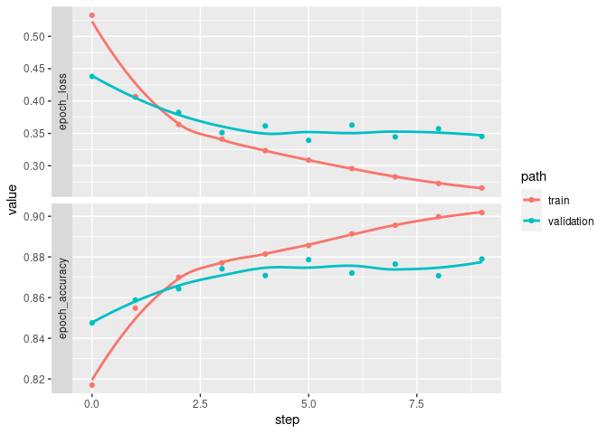
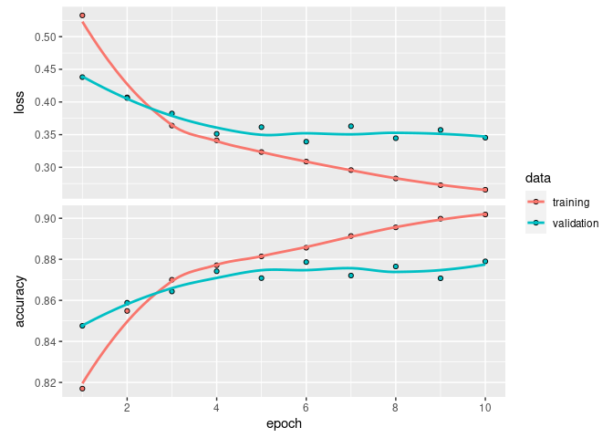

example_keras
================

Here is an example showing how to use *guildai* with TensorFlow and
Keras in R.

If this is your first exposure to *guildai*, we recommend starting with
the framework agnostic “Getting Started” guide. This example assumes
familiarity with guild concepts like *flags* and *scalars*.

We’ll start with an example R script, named “train.R”, that trains,
evaluates, and saves a Keras model using the fashion mnist dataset. Here
is what it looks like:

``` r
library(tensorflow)
library(keras)
use_virtualenv("r-tensorflow")


# Prepare data --------------------------------------------------------

fashion_mnist <- dataset_fashion_mnist()

c(train_images, train_labels) %<-% fashion_mnist$train
c(test_images, test_labels) %<-% fashion_mnist$test

train_images <- train_images / 255
test_images <- test_images / 255

# Define model --------------------------------------------------------

units <- 64

model <-
  keras_model_sequential(input_shape = c(28, 28)) %>%
  layer_flatten() %>%
  layer_dense(units = units, activation = 'relu') %>%
  layer_dense(units = 10, activation = 'softmax')

learning_rate <- 0.001

model %>% compile(
  optimizer = optimizer_adam(learning_rate),
  loss = 'sparse_categorical_crossentropy',
  metrics = c('accuracy')
)

model

# Fit model -----------------------------------------------------------

batch_size <- 32
epochs <- 10

history <- model %>%
  fit(train_images, train_labels,
      validation_split = 0.2,
      batch_size = batch_size,
      epochs = epochs,
      callbacks = list(callback_tensorboard()),
      verbose = 2)

plot(history)

# Evaluate model ------------------------------------------------------

score <- model %>%
  evaluate(test_images, test_labels,
           verbose = 0) %>%
  as.list()

cat('test_loss:', score$loss, "\n")
cat('test_accuracy:', score$accuracy, "\n")


# Save model ----------------------------------------------------------

save_model_tf(model, "model.keras")
saveRDS(history, "history.rds")
```

A few things to note about the script:

- There is no ‘guildai’ specific configuration anywhere in the script.
  It’s a regular R script, that you would normally `source()`.
- Flags like `batch_size`, `epochs`, and `units` are can be defined
  anywhere in the script. We take advantage of this by defining flags
  close to their point of use.
- `callback_tensorboard()` in the list of callbacks provided to the
  `fit()` call will result in tfevent records being written during
  training. Guild will automatically parse these logs for scalars.
- In addition to the tensorboard logs, we are also directly printing two
  scalars named `test_loss` and `test_accuracy` to stdout.
- At the end of the run, we save the model and training history. These
  file artifacts will be stored as part of the run, enabling us to
  restore a trained model.

With our script defined, we can launch a guild run:

``` r
library(guildai)
guild_run("train-keras.R")
## > library(tensorflow)
## > library(keras)
## > use_virtualenv("r-tensorflow")
## > # Prepare data --------------------------------------------------------
## > 
## > fashion_mnist <- dataset_fashion_mnist()
## > c(train_images, train_labels) %<-% fashion_mnist$train
## > c(test_images, test_labels) %<-% fashion_mnist$test
## > train_images <- train_images / 255
## > test_images <- test_images / 255
## > # Define model --------------------------------------------------------
## > 
## > units <- 64
## > model <-
## +   keras_model_sequential(input_shape = c(28, 28)) %>%
## +   layer_flatten() %>%
## +   layer_dense(units = units, activation = 'relu') %>%
## +   layer_dense(units = 10, activation = 'softmax')
## > learning_rate <- 0.001
## > model %>% compile(
## +   optimizer = optimizer_adam(learning_rate),
## +   loss = 'sparse_categorical_crossentropy',
## +   metrics = c('accuracy')
## + )
## > model
## Model: "sequential"
## ________________________________________________________________________________
##  Layer (type)                       Output Shape                    Param #     
## ================================================================================
##  flatten (Flatten)                  (None, 784)                     0           
##  dense_1 (Dense)                    (None, 64)                      50240       
##  dense (Dense)                      (None, 10)                      650         
## ================================================================================
## Total params: 50,890
## Trainable params: 50,890
## Non-trainable params: 0
## ________________________________________________________________________________
## > # Fit model -----------------------------------------------------------
## > 
## > batch_size <- 32
## > epochs <- 10
## > history <- model %>%
## +   fit(train_images, train_labels,
## +       validation_split = 0.2,
## +       batch_size = batch_size,
## +       epochs = epochs,
## +       callbacks = list(callback_tensorboard()),
## +       verbose = 2)
## Epoch 1/10
## WARNING:tensorflow:Callback method `on_train_batch_end` is slow compared to the batch time (batch time: 0.0024s vs `on_train_batch_end` time: 0.0044s). Check your callbacks.
## 1500/1500 - 5s - loss: 0.5415 - accuracy: 0.8112 - val_loss: 0.4634 - val_accuracy: 0.8332 - 5s/epoch - 3ms/step
## Epoch 2/10
## 1500/1500 - 3s - loss: 0.4054 - accuracy: 0.8564 - val_loss: 0.3880 - val_accuracy: 0.8604 - 3s/epoch - 2ms/step
## Epoch 3/10
## 1500/1500 - 3s - loss: 0.3644 - accuracy: 0.8692 - val_loss: 0.3783 - val_accuracy: 0.8632 - 3s/epoch - 2ms/step
## Epoch 4/10
## 1500/1500 - 3s - loss: 0.3390 - accuracy: 0.8775 - val_loss: 0.3675 - val_accuracy: 0.8683 - 3s/epoch - 2ms/step
## Epoch 5/10
## 1500/1500 - 2s - loss: 0.3209 - accuracy: 0.8830 - val_loss: 0.3457 - val_accuracy: 0.8753 - 2s/epoch - 2ms/step
## Epoch 6/10
## 1500/1500 - 2s - loss: 0.3033 - accuracy: 0.8890 - val_loss: 0.3347 - val_accuracy: 0.8819 - 2s/epoch - 2ms/step
## Epoch 7/10
## 1500/1500 - 3s - loss: 0.2937 - accuracy: 0.8917 - val_loss: 0.3313 - val_accuracy: 0.8819 - 3s/epoch - 2ms/step
## Epoch 8/10
## 1500/1500 - 3s - loss: 0.2817 - accuracy: 0.8964 - val_loss: 0.3273 - val_accuracy: 0.8828 - 3s/epoch - 2ms/step
## Epoch 9/10
## 1500/1500 - 3s - loss: 0.2707 - accuracy: 0.9000 - val_loss: 0.3288 - val_accuracy: 0.8842 - 3s/epoch - 2ms/step
## Epoch 10/10
## 1500/1500 - 2s - loss: 0.2651 - accuracy: 0.9019 - val_loss: 0.3378 - val_accuracy: 0.8788 - 2s/epoch - 2ms/step
## > plot(history)
## > # Evaluate model ------------------------------------------------------
## > 
## > score <- model %>%
## +   evaluate(test_images, test_labels,
## +            verbose = 0) %>%
## +   as.list()
## > cat('test_loss:', score$loss, "\n")
## test_loss: 0.370381832122803 
## > cat('test_accuracy:', score$accuracy, "\n")
## test_accuracy: 0.868600010871887 
## > # Save model ----------------------------------------------------------
## > 
## > save_model_tf(model, "model.keras")
## > saveRDS(history, "history.rds")
```

Inspecting the run flags and scalars:

``` r
run <- runs_info(1)
str(run$flags)
## tibble [1 × 4] (S3: tbl_df/tbl/data.frame)
##  $ batch_size   : num 32
##  $ epochs       : num 10
##  $ learning_rate: num 0.001
##  $ units        : num 64
str(run$scalars)
## tibble [1 × 4] (S3: tbl_df/tbl/data.frame)
##  $ test_accuracy: num 0.869
##  $ test_loss    : num 0.37
##  $ train        : tibble [1 × 2] (S3: tbl_df/tbl/data.frame)
##   ..$ epoch_accuracy: num 0.902
##   ..$ epoch_loss    : num 0.265
##  $ validation   : tibble [1 × 4] (S3: tbl_df/tbl/data.frame)
##   ..$ epoch_accuracy                   : num 0.879
##   ..$ epoch_loss                       : num 0.338
##   ..$ evaluation_accuracy_vs_iterations: num 0.869
##   ..$ evaluation_loss_vs_iterations    : num 0.37
```

`runs_info()` returns the last value for each scalar. The full history
of scalars emitted is available with `runs_scalars()`.

``` r
all_scalars <- runs_scalars(1) 

all_scalars |>
  dplyr::arrange(step)
## # A tibble: 64 × 5
##    run                              path       tag            value  step
##    <chr>                            <chr>      <chr>          <dbl> <dbl>
##  1 29af1c87e5454ee3a300f2e25d827a31 <NA>       test_loss      0.370     0
##  2 29af1c87e5454ee3a300f2e25d827a31 <NA>       test_accuracy  0.869     0
##  3 29af1c87e5454ee3a300f2e25d827a31 validation epoch_loss     0.463     0
##  4 29af1c87e5454ee3a300f2e25d827a31 validation epoch_accuracy 0.833     0
##  5 29af1c87e5454ee3a300f2e25d827a31 train      epoch_loss     0.541     0
##  6 29af1c87e5454ee3a300f2e25d827a31 train      epoch_accuracy 0.811     0
##  7 29af1c87e5454ee3a300f2e25d827a31 validation epoch_loss     0.388     1
##  8 29af1c87e5454ee3a300f2e25d827a31 validation epoch_accuracy 0.860     1
##  9 29af1c87e5454ee3a300f2e25d827a31 train      epoch_loss     0.405     1
## 10 29af1c87e5454ee3a300f2e25d827a31 train      epoch_accuracy 0.856     1
## # … with 54 more rows
```

We can plot scalars vs step for the full training history:

``` r
library(dplyr)
## 
## Attaching package: 'dplyr'
## The following objects are masked from 'package:stats':
## 
##     filter, lag
## The following objects are masked from 'package:base':
## 
##     intersect, setdiff, setequal, union
library(ggplot2)

all_scalars %>%
  filter(tag %in% c("epoch_accuracy", "epoch_loss")) %>% 
  mutate(tag = forcats::fct_rev(tag)) %>% 
  ggplot(aes(x = step, y = value, color = path)) + 
  facet_grid(rows = vars(tag), switch = 'y', scales = 'free_y') +
  geom_point() + geom_smooth(se = FALSE)
## `geom_smooth()` using method = 'loess' and formula = 'y ~ x'
```



We can compare this to the `history` object from `fit()` we saved in the
run. It is indeed the same.

``` r
list.files(run$dir)
## [1] "history.rds"   "logs"          "model.keras"   "plots"        
## [5] "train-keras.R"

history <- readRDS(file.path(run$dir, "history.rds"))
library(keras) # to load the plot.keras_training_history() method
plot(history)
```



Finally, we can load the model trained during the run by accessing the
saved files directly.

``` r
model <- load_model_tf(file.path(run$dir, "model.keras"))
model
## Model: "sequential"
## ________________________________________________________________________________
##  Layer (type)                       Output Shape                    Param #     
## ================================================================================
##  flatten (Flatten)                  (None, 784)                     0           
##  dense_1 (Dense)                    (None, 64)                      50240       
##  dense (Dense)                      (None, 10)                      650         
## ================================================================================
## Total params: 50,890
## Trainable params: 50,890
## Non-trainable params: 0
## ________________________________________________________________________________
```
