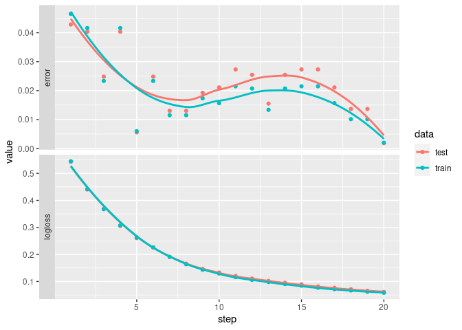

Here is an example showing how to use *guildai* with xgboost in R.

If this is your first exposure to *guildai*, we recommend starting with
the framework agnostic "Getting Started" guide. This example assumes
familiarity with guild concepts like *flags* and *scalars*.

We'll start with an example R script, named "train-xgboost.R", that
trains, evaluates, and saves an xgboost model using the "agaricus"
dataset. The script is adapted from the [XGBoost R
Tutorial](https://xgboost.readthedocs.io/en/stable/R-package/xgboostPresentation.html).
Here is what it looks like:

::: {.cell file="train-xgboost.R"}
``` {.r .cell-code}
#| output-scalars:
#|   - step: '\[(\step)]'
#|   - '(\key):(\value)'

library(xgboost)
data(agaricus.train, package='xgboost')
data(agaricus.test, package='xgboost')
train <- agaricus.train
test <- agaricus.test

dtrain <- xgb.DMatrix(data = train$data, label=train$label)
dtest <- xgb.DMatrix(data = test$data, label=test$label)

watchlist <- list(train=dtrain, test=dtest)

nrounds = 20
eta = .2 # 1

bst <- xgb.train(
  data = dtrain,
  max.depth = 2,
  eta = eta,
  nthread = 2,
  nrounds = nrounds,
  watchlist = watchlist,
  eval.metric = "error",
  eval.metric = "logloss",
  objective = "binary:logistic"
)

# save model to binary local file
xgb.save(bst, "xgboost.model")
```
:::

A few things to note about the script:

-   There is no 'guildai' specific configuration in the script code.
    It's a regular R script, that you can safely `source()` or work with
    interactively at the REPL.
-   We declare two custom `output-scalars` patterns in the scripts
    comment frontmatter. This informs guild how to parse the default
    xgboost stdout output and extract scalar values from it.
-   At the end of the run, we save the model to the current working
    directory. This file artifacts will be stored as part of the run,
    enabling us to later recover the trained model.

With our script defined, we can launch a guild run:

::: cell
``` {.r .cell-code}
library(guildai)
guild_run("train-xgboost.R")
## > #| output-scalars:
## > #|   - step: '\[(\step)]'
## > #|   - '(\key):(\value)'
## > 
## > library(xgboost)
## > data(agaricus.train, package='xgboost')
## > data(agaricus.test, package='xgboost')
## > train <- agaricus.train
## > test <- agaricus.test
## > dtrain <- xgb.DMatrix(data = train$data, label=train$label)
## > dtest <- xgb.DMatrix(data = test$data, label=test$label)
## > watchlist <- list(train=dtrain, test=dtest)
## > nrounds = 20
## > eta = .2 # 1
## > bst <- xgb.train(
## +   data = dtrain,
## +   max.depth = 2,
## +   eta = eta,
## +   nthread = 2,
## +   nrounds = nrounds,
## +   watchlist = watchlist,
## +   eval.metric = "error",
## +   eval.metric = "logloss",
## +   objective = "binary:logistic"
## + )
## [1]  train-error:0.046522    train-logloss:0.544737  test-error:0.042831 test-logloss:0.543282 
## [2]  train-error:0.041609    train-logloss:0.441820  test-error:0.040348 test-logloss:0.440453 
## [3]  train-error:0.023338    train-logloss:0.367894  test-error:0.024829 test-logloss:0.367593 
## [4]  train-error:0.041609    train-logloss:0.307582  test-error:0.040348 test-logloss:0.305584 
## [5]  train-error:0.005988    train-logloss:0.262504  test-error:0.005587 test-logloss:0.260576 
## [6]  train-error:0.023338    train-logloss:0.226496  test-error:0.024829 test-logloss:0.225653 
## [7]  train-error:0.011515    train-logloss:0.190894  test-error:0.013035 test-logloss:0.191412 
## [8]  train-error:0.011515    train-logloss:0.163972  test-error:0.013035 test-logloss:0.165692 
## [9]  train-error:0.017350    train-logloss:0.143502  test-error:0.019243 test-logloss:0.146280 
## [10] train-error:0.015661    train-logloss:0.129690  test-error:0.021105 test-logloss:0.132982 
## [11] train-error:0.021495    train-logloss:0.116178  test-error:0.027312 test-logloss:0.120329 
## [12] train-error:0.020728    train-logloss:0.105877  test-error:0.025450 test-logloss:0.110788 
## [13] train-error:0.013358    train-logloss:0.097936  test-error:0.015518 test-logloss:0.102105 
## [14] train-error:0.020728    train-logloss:0.090436  test-error:0.025450 test-logloss:0.095189 
## [15] train-error:0.021495    train-logloss:0.084507  test-error:0.027312 test-logloss:0.089555 
## [16] train-error:0.021495    train-logloss:0.077198  test-error:0.027312 test-logloss:0.081516 
## [17] train-error:0.015661    train-logloss:0.071895  test-error:0.021105 test-logloss:0.076497 
## [18] train-error:0.010134    train-logloss:0.066899  test-error:0.013656 test-logloss:0.071019 
## [19] train-error:0.010134    train-logloss:0.062276  test-error:0.013656 test-logloss:0.065473 
## [20] train-error:0.001996    train-logloss:0.058151  test-error:0.001862 test-logloss:0.061222 
## > # save model to binary local file
## > xgb.save(bst, "xgboost.model")
## [1] TRUE
```
:::

Inspecting the run flags and scalars:

::: {.cell paged.print="false"}
``` {.r .cell-code}
run <- runs_info(1)
str(run$flags)
## tibble [1 × 2] (S3: tbl_df/tbl/data.frame)
##  $ eta    : num 0.2
##  $ nrounds: num 20
str(run$scalars)
## tibble [1 × 4] (S3: tbl_df/tbl/data.frame)
##  $ test-error   : num 0.00186
##  $ test-logloss : num 0.0612
##  $ train-error  : num 0.002
##  $ train-logloss: num 0.0582
```
:::

`runs_info()` returns the last value for each scalar. The full history
of scalars emitted is available with `runs_scalars()`.

::: {.cell paged.print="false"}
``` {.r .cell-code}
scalars <- runs_scalars(1)
scalars
## # A tibble: 80 × 5
##    run                              path  tag            value  step
##    <chr>                            <chr> <chr>          <dbl> <dbl>
##  1 3d5df8a345364a319ba95509cb798adc <NA>  test-error    0.0428     1
##  2 3d5df8a345364a319ba95509cb798adc <NA>  test-logloss  0.543      1
##  3 3d5df8a345364a319ba95509cb798adc <NA>  train-error   0.0465     1
##  4 3d5df8a345364a319ba95509cb798adc <NA>  train-logloss 0.545      1
##  5 3d5df8a345364a319ba95509cb798adc <NA>  test-error    0.0403     2
##  6 3d5df8a345364a319ba95509cb798adc <NA>  test-logloss  0.440      2
##  7 3d5df8a345364a319ba95509cb798adc <NA>  train-error   0.0416     2
##  8 3d5df8a345364a319ba95509cb798adc <NA>  train-logloss 0.442      2
##  9 3d5df8a345364a319ba95509cb798adc <NA>  test-error    0.0248     3
## 10 3d5df8a345364a319ba95509cb798adc <NA>  test-logloss  0.368      3
## # … with 70 more rows
```
:::

::: cell
``` {.r .cell-code}
library(dplyr)
library(tidyr)
library(ggplot2)

scalars %>%
  select(-path) %>%
  tidyr::separate(tag, c("data", "metric")) %>%
  ggplot(aes(x = step, y = value, color = data)) +
  facet_grid(rows = vars(metric), switch = 'y', scales = 'free_y') +
  geom_point() + geom_smooth(se = FALSE)
```

::: cell-output-display

:::
:::

Finally, we can load the model trained during the run by accessing the
saved file from the `run$dir`.

::: cell
``` {.r .cell-code}
model <- xgboost::xgb.load(file.path(run$dir, "xgboost.model"))
model
## ##### xgb.Booster
## raw: 21.2 Kb 
## xgb.attributes:
##   niter
## niter: 19
```
:::
