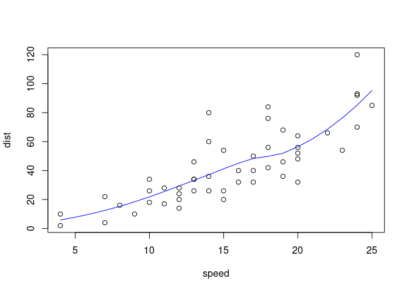
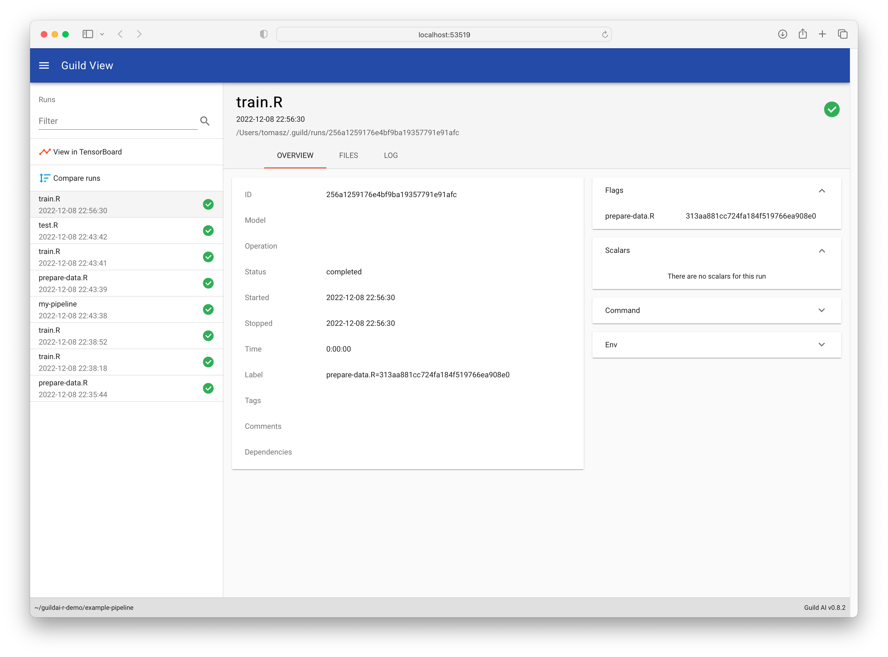
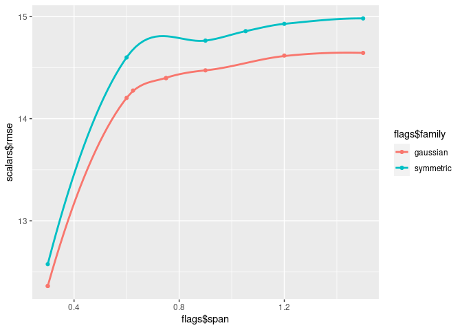

```{=html}
<!-- TODO a nice screenshot image here-->
```
*guildai* provides a suite of tools for tracking, visualizing, and
managing machine learning experiments. The *guildai* R package is a
successor to the *tfruns* package.

-   Track the hyperparameters, metrics, output, and source code of every
    training run.

-   Compare hyperparmaeters and metrics across runs to find the best
    performing model.

-   No changes to source code required.

# Installation

The R package provides an interface to [Guild AI
Core](https://guild.ai/). The R package will automatically download and
install Guild AI Core on first use, or you can call `install_guild()`
directly to customize the installation.

``` r
# install.packages("guildai")
if(!requireNamespace("remotes"))
  install.packages("remotes", repos = "https://cran.rstudio.com")
remotes::install_github("t-kalinowski/guildai-r")
guildai::install_guild()
```

# Launch a Run

Guild AI can be used with any machine learning framework, or no
framework at all. The Examples section in the top navbar shows how you
can use guild with common machine learning frameworks like xgboost,
tensorflow and keras, torch, mlr3 and tidymodels.

In this introductory example, we'll start by showing guild with no
framework at all, on a very simple (and somewhat contrived) example.

Say we have an R script named `"train.R"` where we are fitting a
smoother line, like so:

::: cell
:::

::: {.cell file="train.R"}
``` {.r .cell-code}
model <- loess(dist ~ speed, data = cars)

plot(dist ~ speed, data = cars)
lines(x = 3:30, y = predict(model, 3:30), col = "blue")
```

::: cell-output-display

:::
:::

To train a model with guildai, use the `guild_run()` function in place
of the `source()` function to execute your R script. For example:

::: cell
``` {.r .cell-code}
library(guildai)
guild_run("train.R")
## > model <- loess(dist ~ speed, data = cars)
## > plot(dist ~ speed, data = cars)
## > lines(x = 3:30, y = predict(model, 3:30), col = "blue")
```
:::

This will launch a new R process in an isolated run directory using the
provided script. By default, the output stream from the run will be
shown at the R console (the same output stream you would see with
`source("train.R", echo = TRUE)` in the R console, or `R --file=train.R`
in the terminal).

# View Runs

## In an Interactive Application

Call `guild_view()` to launch the *Guild View* application, which you
can use to visualize and manage your runs. You can use it to search,
filter, visualize, compare run source code and output, and more! It also
bundles TensorBoard as an additional visualization tool for viewing
runs.

``` r
guild_view()
```



## In R

Retrieve a data frame with run information in R using `runs_info()`:

::: cell
``` {.r .cell-code}
run <- runs_info()
tibble::glimpse(run)
## Rows: 1
## Columns: 15
## $ label       <chr> ""
## $ tags        <list> <>
## $ marked      <lgl> FALSE
## $ flags       <tibble[,0]> <tbl_df[1 x 0]>
## $ scalars     <tibble[,0]> <tbl_df[1 x 0]>
## $ operation   <chr> "train.R"
## $ started     <dttm> 2023-01-24 21:23:58
## $ stopped     <dttm> 2023-01-24 21:23:59
## $ comments    <list> [<tbl_df[0 x 4]>]
## $ status      <chr> "completed"
## $ exit_status <int> 0
## $ deps        <list> []
## $ project_dir <chr> "/tmp/RtmpzirAbr/guildai-intro-sample-project-73ae206d330e"
## $ dir         <chr> "/tmp/RtmpzirAbr/guildai-intro-sample-project-73ae206d330e…
## $ id          <chr> "5a96a84b10eb4487beaea4ee720f0b08"
```
:::

`runs_info()` returns a data frame with information about runs, one row
per run. In this introduction so far, we've only launched 1 run, so so
`runs_info()` returns a 1-row data frame.

`runs_info()` supports a rich set of filter options that can be
conveniently supplied. For example:

::: cell
``` {.r .cell-code}
ls_runs(1)            # get the most recent run
ls_runs(error = TRUE) # get only runs that returned an error
```
:::

See `?runs_info()` for more information.

## In the Filesystem

`guild_view()` and `runs_info()` provide two convenient ways to gather
and present the information from runs. Importantly however, the run
directories themselves are easily accessible. There you'll find any
files, plots, logs, or other output generated by a run. The run
directory also contains additional metadata about the runs that guild
recorded under the ".guild" folder. There you'll find plain text (yaml)
files with information like the starting random seed, environment
variables, information about the package versions, and other metadata
frequently useful for reproducability.

::: cell
``` {.r .cell-code}
fs::dir_tree(run$dir[1], all = TRUE)
## /tmp/RtmpzirAbr/guildai-intro-sample-project-73ae206d330e/.guild/runs/5a96a84b10eb4487beaea4ee720f0b08
## ├── .guild
## │   ├── attrs
## │   │   ├── cmd
## │   │   ├── deps
## │   │   ├── env
## │   │   ├── exit_status
## │   │   ├── flags
## │   │   ├── host
## │   │   ├── id
## │   │   ├── initialized
## │   │   ├── op
## │   │   ├── platform
## │   │   ├── plugins
## │   │   ├── r_packages_loaded
## │   │   ├── random_seed
## │   │   ├── run_params
## │   │   ├── sourcecode_digest
## │   │   ├── started
## │   │   ├── stopped
## │   │   ├── user
## │   │   └── user_flags
## │   ├── manifest
## │   ├── opref
## │   ├── output
## │   └── output.index
## ├── plots
## │   └── Rplot001.png
## └── train.R
```
:::

# Flags

Flags are a form of run inputs, or paramaterization. `guild_run()` can
modify flags when launching runs, and `guild_view()` and `runs_info()`
make it easy to compare flags across runs. Any scalar literal assigned
at the top level of a run script is automatically identified as a
*flag*.

## Supplying run flag values

To illustrate, we'll modify our script "train.R" by adding flags `span`
and `family`, which we pass as arguments to the `loess()` smoother:

::: cell
:::

::: {.cell file="train.R"}
``` {.r .cell-code}
span <- .75
family <- "gaussian"

model <- loess(dist ~ speed, data = cars,
               span = span, family = family)

plot(dist ~ speed, data = cars)
lines(x = 3:30, y = predict(model, 3:30), col = "blue")
```
:::

You can launch a run with different flag values like this:

::: cell
``` {.r .cell-code}
guild_run("train.R", flags = list(
  span = 1.5,
  family = "symmetric"
))
```
:::

`guild_run()` will modify the script file with the requested flag values
when starting the run, as if we had modified them manually. This change
is persistent, and will be visible when inspecting the snapshot of run
sources captured, e.g., with `guild_view()` (or `guild diff`, or
inspecting in the filesystem).

The flags interface is useful for experimentation and hyperparamater
optimization. At it's simplest, you can iterate over the set of flag
values you want and pass them to separate calls of `guild_run()`:

::: cell
``` {.r .cell-code}
for (span in c(0.5, 0.75, 1, 1.25))
  guild_run("train.R", list(span = span))
```
:::

You can also pass multiple values for each flag, and guild will
automatically expand the combinations to a grid. For example, this will
launch 4 training runs, each a unique pairing of flags.

::: cell
``` {.r .cell-code}
guild_run("train.R", flags = list(
  span = c(0.5, 0.75),
  family = c("gaussian", "symmetric")
))
```
:::

Another way to launch a batch of runs is to pass a data frame of flags
values, with each row corresponding to a run.

::: cell
``` {.r .cell-code}
flags_df <- expand.grid(span = c(0.5, 0.75),
                        family = c("gaussian", "symmetric"))
flags_df
##   span    family
## 1 0.50  gaussian
## 2 0.75  gaussian
## 3 0.50 symmetric
## 4 0.75 symmetric
```
:::

::: cell
``` {.r .cell-code}
guild_run("train.R", flags = flags_df, echo = FALSE)
```
:::

## Retreiving run flags

The flags and flag values associated with each runs are returned by
`runs_info()` as a packed dataframe under the `flags` name.

::: {.cell paged.print="false"}
``` {.r .cell-code}
runs <- runs_info(1:4) # retrieve the last 4 runs
runs$flags
## # A tibble: 4 × 2
##   family     span
##   <chr>     <dbl>
## 1 symmetric  0.75
## 2 symmetric  0.5 
## 3 gaussian   0.75
## 4 gaussian   0.5
```
:::

# Scalars

The counterpart to run *flags* are run *scalars*. Whereas *flags* are a
a special type of run input that guild can help manage, *scalars* are
special type of run output that guild can help manage.

Any lines printed to stdout matching this pattern are identified as a
scalar:

``` verbatim
key: <numeric>
```

To illustrate, here is "train.R" updated to output two scalars, `rmse`
and `mse`.

::: cell
:::

::: {.cell file="train.R"}
``` {.r .cell-code}
span <- .75
family <- "gaussian"

model <- loess(dist ~ speed, data = cars,
               span = span, family = family)

plot(dist ~ speed, data = cars)
lines(x = 3:30, y = predict(model, 3:30), col = "blue")

mse <- mean(residuals(model)^2)
rmse <- sqrt(mse)

cat("mse:", mse, "\n")
cat("rmse:", rmse, "\n")
```
:::

::: cell
``` {.r .cell-code}
guild_run("train.R")
## > span <- .75
## > family <- "gaussian"
## > model <- loess(dist ~ speed, data = cars,
## +                span = span, family = family)
## > plot(dist ~ speed, data = cars)
## > lines(x = 3:30, y = predict(model, 3:30), col = "blue")
## > mse <- mean(residuals(model)^2)
## > rmse <- sqrt(mse)
## > cat("mse:", mse, "\n")
## mse: 207.274320377417 
## > cat("rmse:", rmse, "\n")
## rmse: 14.3970247057306
```
:::

When the script is run, these two lines in the printed output are
identified by guild as scalars:

``` verbatim
mse: 207.274320377417
rmse: 14.3970247057306
```

We can retrieve the scalar results from runs with `runs_info()`:

::: cell
``` {.r .cell-code}
runs_info(1)$scalars
## # A tibble: 1 × 2
##     mse  rmse
##   <dbl> <dbl>
## 1  207.  14.4
```
:::

Here we see that guild has automatically identified `rmse` and `mse` as
scalars.

If you are printing values for the same scalar `key` multiple times
during a run (e.g, `loss` during a training loop), then be sure to also
print a `step` scalar in between, to enable guild to track history (and
enable visualization of the run metrics with Guild View and
TensorBoard).

`runs_info()` returns the last observed value for each run scalar key,
but the full history of scalars observed in runs can also be accessed
from R directly via `runs_scalars()`.

If the run produces tfevent records in the run directory (e.g., via
`keras::callback_tensorboard()` or `tfevents::log_event()`), those are
also automatically identified by guild as run scalars, and included in
`runs_info()` (and `guild_view()`, and TensorBoard and other run views).

# Guild Configuration

Guild accepts a variety of operation configuration options. One
convenient way of supplying configuration options is via hashpipe yaml
(`#|`) comments in the R script. Hashpipe comments are always parsed as
yaml (because yaml is a superset of json, json is also valid).

## Operation configuration

Guild options can be supplied as hashpipe yaml in the frontmatter of the
script (in lines 1-n). For example, we can inform guild that guild
should not echo the R expressions in the stdout log by supplying
`echo: no` like this.

``` r
#| echo: no

model <- loess(dist ~ speed, data = cars,
               span = span, family = family)
```

A comprehensive listing of all the operation configuration options that
can be supplied to guild via script frontmatter can be found
[here](https://my.guild.ai/t/guild-file-reference/197#operation-attributes-6).

## Flag configuration

You can optionally supply additional metadata about individual flags by
placing hashpipe yaml annotations above the flag expression.

### Flag constraints

For example, we can update our "train.R" script to add constraints to
the `span` and `family` flags. For `span` we'll set a range of valid
values from 0.3--3.0. For `family` we'll define a set of two valid
string values `family` can take, `"gaussian"` or `"symmetric"`.

::: cell
:::

::: {.cell file="train.R"}
``` {.r .cell-code}
#| echo: no

#| {min: .3, max: 3}
span <- .75

#| choices: [gaussian, symmetric]
family <- "gaussian"

model <- loess(dist ~ speed, data = cars,
               span = span, family = family)

plot(dist ~ speed, data = cars)
lines(x = 3:30, y = predict(model, 3:30), col = "blue")

rmse <- sqrt(mean(residuals(model)^2))
cat("rmse:", rmse, "\n")
```
:::

Now if you attempt to launch the run with a flag value that's outside
the constraints defined, guild will throw an error:

::: cell
``` {.r .cell-code}
guild_run("train.R", flags = list(span = 99)) # error
## guild: invalid value 99.0 for span: out of range (greater than max 3)
```
:::

### Flag destinations

As a project grows, it can be helpful to be able to move flag
definitions out of the main R script. To do so, you can include a
`flags-dest` in the frontmatter of the R script, specifying the file
where guild should read and update the flag values. Then you can read in
the flag values in the main R script using `source()` or similar.

``` r
#| flags-dest: ./flags.R

FLAGS <- envir::include("flags.R", new.env())

model <- loess(dist ~ speed, data = cars,
               span = FLAGS$span,
               family = FLAGS$family)
```

YAML files are also supported as a flags destination:

``` r
#| flags-dest: ./flags.yml

FLAGS <- yaml::read_yaml("flags.yml")

model <- loess(dist ~ speed, data = cars,
               span = FLAGS$span,
               family = FLAGS$family)
```

# Hyperparameter Optimization

The combination of flags with constraints and scalars make it possible
to use a hyperparamater optimizer with guild. Here, *flags* are the
hyperamaters, *flag constraints* define the hyperparameter search space,
and a *scalar* is the objective to minimize or maximize.

To illustrate, here is an example run R script:

::: cell
:::

::: {.cell file="train.R"}
``` {.r .cell-code}
#| echo: no

#| {min: .3, max: 3}
span <- .75

#| choices: [gaussian, symmetric]
family <- "gaussian"

model <- loess(dist ~ speed, data = cars,
               span = span, family = family)

plot(dist ~ speed, data = cars)
lines(x = 3:30, y = predict(model, 3:30), col = "blue")

rmse <- sqrt(mean(residuals(model)^2))
cat("rmse:", rmse, "\n")
```
:::

You can use an optimizer with this operation like so:

::: cell
``` {.r .cell-code}
guild_run("train.R",
          optimizer = "bayesian",
          minimize = "rmse",
          max_trials = 5)
## INFO: [guild] Random start for optimization (1 of 3)
## INFO: [guild] Running trial 49b6befcb62f40c2be2c9518c0bf585a: train.R (family=gaussian, span=0.75)
## rmse: 14.3970247057306 
## INFO: [guild] Random start for optimization (2 of 3)
## INFO: [guild] Running trial f94aacfb6dc2410cadfae3102e1d7061: train.R (family=symmetric, span=1.0529223408343051)
## rmse: 14.8566141121218 
## INFO: [guild] Random start for optimization (3 of 3)
## INFO: [guild] Running trial 8d7d31b7ac844205835bbdbd16648b1f: train.R (family=gaussian, span=0.624545853823467)
## rmse: 14.2754077059686 
## INFO: [guild] Found 3 previous trial(s) for use in optimization
## INFO: [guild] Running trial c2f4e55def704bd6b79e1ba91dd8f230: train.R (family=gaussian, span=0.3)
## rmse: 12.3620973783366 
## INFO: [guild] Found 4 previous trial(s) for use in optimization
## INFO: [guild] Running trial 1faaa574929e4c6a83996574f4a386d4: train.R (family=symmetric, span=3.0)
## rmse: 15.0532143004737
```
:::

See [here](https://my.guild.ai/t/optimizers-reference/43) for
documentation on the optimizers built-in to guild.

# Managing runs

Guild comes with a family of functions for managing runs.

-   Annotate runs: `runs_comment()`, `runs_mark()` and `runs_tag()`.
-   Move, archive, or copy runs: `runs_export()` and `runs_import()`.
-   Delete runs: `runs_delete()` `runs_purge()` `runs_restore()`.

The `runs_*` family of functions all take `runs` as a first argument,
and can be composed with `|>`. The `runs` arguments can be supplied as
data frame, as returned by `runs_info()` or `runs_scalars()`. `runs` can
also be a character vector, with a flexible syntax supported for
specifying runs selections: For example, `runs` can be an `id`, an
integer (the n-th last run), or any combination of filter specifications
like `running = TRUE` and `started  = 'last hour'`. See `?runs_info()`
for details.

To illustrate, lets launch a few runs and then investigate the results
from all our previous runs (including the 10 hyperparameter optimization
runs, as well as the runs with flag values we manually launched earlier
in this guide):

::: cell
``` {.r .cell-code}
guild_run("train.R", echo = FALSE, flags = list(
  span = seq(.3, 1.5, length.out = 5),
  family = c("symmetric", "gaussian")
))
```
:::

::: {.cell paged.print="false"}
``` {.r .cell-code}
library(dplyr, warn.conflicts = FALSE)
library(ggplot2)

runs <- runs_info()

runs
## # A tibble: 21 × 15
##    label                tags  marked flags…¹ scala…² opera…³ started            
##    <chr>                <lis> <lgl>  <chr>     <dbl> <chr>   <dttm>             
##  1 family=gaussian spa… <chr> FALSE  gaussi…    14.6 train.R 2023-01-24 21:24:19
##  2 family=gaussian spa… <chr> FALSE  gaussi…    14.6 train.R 2023-01-24 21:24:19
##  3 family=gaussian spa… <chr> FALSE  gaussi…    14.5 train.R 2023-01-24 21:24:18
##  4 family=gaussian spa… <chr> FALSE  gaussi…    14.2 train.R 2023-01-24 21:24:18
##  5 family=gaussian spa… <chr> FALSE  gaussi…    12.4 train.R 2023-01-24 21:24:17
##  6 family=symmetric sp… <chr> FALSE  symmet…    15.0 train.R 2023-01-24 21:24:16
##  7 family=symmetric sp… <chr> FALSE  symmet…    14.9 train.R 2023-01-24 21:24:16
##  8 family=symmetric sp… <chr> FALSE  symmet…    14.8 train.R 2023-01-24 21:24:15
##  9 family=symmetric sp… <chr> FALSE  symmet…    14.6 train.R 2023-01-24 21:24:15
## 10 family=symmetric sp… <chr> FALSE  symmet…    12.6 train.R 2023-01-24 21:24:14
## # … with 11 more rows, 10 more variables: flags$span <dbl>, scalars$mse <dbl>,
## #   stopped <dttm>, comments <list>, status <chr>, exit_status <int>,
## #   deps <list>, project_dir <chr>, dir <chr>, id <chr>, and abbreviated
## #   variable names ¹​flags$family, ²​scalars$rmse, ³​operation

runs <- runs %>%
  # filter out runs that didn't print 'rmse: <numeric>'
  filter(!is.na(scalars$rmse)) %>%
  # filter out runs where the flag `span` was over 1.5
  filter(flags$span <= 1.5)

runs %>%
  ggplot(aes(x = flags$span, y = scalars$rmse,
             color = flags$family)) +
  geom_point() + geom_smooth(se = FALSE)
```

::: cell-output-display

:::
:::

::: {.cell paged.print="false"}
``` {.r .cell-code}
best_run <- runs |>
  filter(flags$family == "gaussian") |>
  slice_min(scalars$rmse)

tibble::glimpse(best_run)
## Rows: 2
## Columns: 15
## $ label       <chr> "family=gaussian span=0.3", "family=gaussian span=0.3"
## $ tags        <list> <>, <>
## $ marked      <lgl> FALSE, FALSE
## $ flags       <tibble[,2]> <tbl_df[2 x 2]>
## $ scalars     <tibble[,2]> <tbl_df[2 x 2]>
## $ operation   <chr> "train.R", "train.R"
## $ started     <dttm> 2023-01-24 21:24:17, 2023-01-24 21:24:11
## $ stopped     <dttm> 2023-01-24 21:24:18, 2023-01-24 21:24:11
## $ comments    <list> [<tbl_df[0 x 4]>], [<tbl_df[0 x 4]>]
## $ status      <chr> "completed", "completed"
## $ exit_status <int> 0, 0
## $ deps        <list> [], []
## $ project_dir <chr> "/tmp/RtmpzirAbr/guildai-intro-sample-project-73ae206d330e…
## $ dir         <chr> "/tmp/RtmpzirAbr/guildai-intro-sample-project-73ae206d330…
## $ id          <chr> "c7aeb706c124407a9f5b55d7133c4308", "c2f4e55def704bd6b79e1…

best_run |>
  runs_tag("best") |>
  runs_export("./best-runs")
## Modified tags for 2 run(s)
## Copying c7aeb706c124407a9f5b55d7133c4308
## Copying c2f4e55def704bd6b79e1ba91dd8f230
## Exported 2 run(s) to ./best-runs
```
:::

## Using guild from the terminal

`guild` can also be used directly from the terminal. Call the R function
`install_guild_cli()` to place the `guild` executable installed by
`guildai::install_guild()` on your PATH:

``` r
export_guild_cli(dest = "~/bin")
```

Then you can launch runs and perform other guild operations from the
terminal:

``` bash
guild run train.R
guild run train.R batch_size='[32,64]'
```

As you move between the terminal and the R console, almost all of the
same syntax supported at the terminal can be used in R by passing
strings to the respective R functions.

By default, R character vectors supplied to `...` throughout most R
functions are quoted for the system shell and passed through to guild.
This enables usage like:

``` r
guild_run("train.R", "batch_size=[32,64]")
```

There are some additional conveniences provided for passing through
command line options from R.

-   Use `I()` to avoid quoting a string for the shell, allowing you to
    pass through multiple arguments in a single string.
-   For arguments that take values, you can pass them from R as named
    arguments or named objects.
-   Named arguments are automatically translated from R conventions to
    shell conventions:
    -   `_` in a argument name is converted to `-`, and a `--` prefix is
        automatically added, so `batch_comment = "foo"` becomes
        `--batch_comment 'foo'`.
    -   boolean values are understood to be switches, so
        `running = TRUE` is translated to `--running`,
        while`running = FALSE` is translated to`--not-running`.
    -   names vectors are automatically recycled for the shell, so
        `tag = c("a", "b" "c")` becomes `--tag a --tag b --tag c`.
    -   A single leading `.` in an argument name is treated as a short
        option name, e.g., `.Fs = "last hour"` becomes `-Fs 'last hour'`
    -   Nested lists are recursively flattened into a single character
        vector

Here are a few different R expressions that invoke `guild` with
identical system calls.

``` r
runs_info(marked = TRUE, started = 'last hour')
runs_info("--marked", "--started" = "last hour")
runs_info("--marked", c("--started", "last hour"))
runs_info("--marked", c("--started" = "last hour"))
runs_info(c("--marked", "--started", "last hour"))
runs_info(I("--marked --started 'last hour'"))
runs_info(I("-Fm -Fs 'last hour'"))
runs_info(.Fm = TRUE, .Fs = 'last hour')
runs_info("-Fm", "-Fs" = "last hour")
```

### Addin

The **guildai** package installs an RStudio IDE addin which provides
quick access to frequently used functions from the Addins menu:

Note that you can use **Tools** -\> **Modify Keyboard Shortcuts** within
RStudio to assign a keyboard shortcut to one or more of the addin
commands.

Specifically three addins are provided:

-   Launch a `guild_run()` with the current source document.
-   Launch `guild_view()`.
-   View `runs_info()` in the interactive table viewer.

It's recomended that the action for "Launch `guild_run()`" be assigned
to keyboard shortcut Ctrl/Cmd + Alt + Enter.

### Background Training

Since training runs can become quite lengthy, it's often useful to run
them in the background in order to keep the R console free for other
work. In the RStudio IDE, `guild_run()` automatically launches runs as
background jobs. To disable this feature, set
`options(guildai.run_as_job = FALSE)`.

# Learn More

See https://my.guild.ai/t/guild-ai-documentation/64 for more
information.
